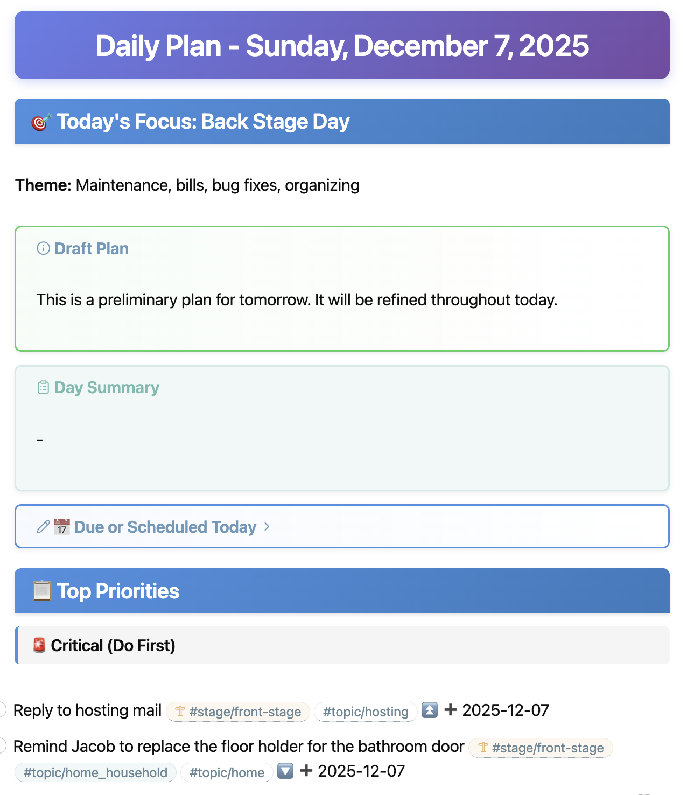

# Today

> **Beta Testing Note (December 2025)**
>
> This project is transitioning to a plugin-based architecture. The documentation below will be revised to reflect these changes. For beta testers, here's how to get started:
>
> ```bash
> # 1. Clone and install
> git clone https://github.com/jeffcovey/today.git
> cd today
> npm install
>
> # 2. Copy config templates
> cp config.toml.example config.toml
> cp .env.example .env
>
> # 3. Configure plugins interactively
> bin/plugins configure
>
> # 4. Sync data from your configured sources
> bin/plugins sync
>
> # 5. Start a daily review session with Claude
> bin/today
> ```
>
> Key commands for exploring the system:
> - `bin/plugins list` - See available plugins
> - `bin/tasks today` - View today's tasks
> - `bin/track today` - View time tracking
> - `bin/habits today` - View habits (requires Streaks app)
> - `bin/calendar today` - View calendar events

---

A personal command center for daily planning and productivity. Uses AI-assisted daily reviews, markdown-based task management, and integrations with email, calendar, and time tracking to help you decide what to do each day.

<p align="center">
  
</p>

## Features

- **AI-Powered Daily Reviews** - Claude-assisted morning reviews that synthesize calendar events, tasks, emails, and time tracking into actionable daily plans
- **Vault-Based Task Management** - Markdown files using [Obsidian Tasks](https://publish.obsidian.md/tasks/) syntax for portable, version-controlled tasks
- **Stage Themes** - Focus different days on different types of work (front-stage, back-stage, off-stage)
- **Multi-Source Sync** - Pull data from Google Calendar, iCloud, email (IMAP), Toggl time tracking, and more
- **Local-First** - All data stored in local markdown files; sync to cloud services is optional

## Quick Start

```bash
# Clone the repository
git clone https://github.com/jeffcovey/today.git
cd today

# Install dependencies
npm install

# Copy configuration templates
cp config.toml.example config.toml
cp .env.example .env

# Edit config.toml with your preferences (timezone, profile, etc.)
# Edit .env with your API keys and credentials

# Run daily planning (syncs data, initializes vault on first run)
bin/today
```

## Prerequisites

**Required:**

- **Node.js 20+** - JavaScript runtime
- **Claude Code CLI** - Anthropic's AI assistant for daily reviews
- **sqlite3** - Database operations
- **Anthropic API key** - For AI features (set in `.env`)

**Optional integrations:**

- Google Calendar service account
- iCloud account for calendar sync
- IMAP email account
- Toggl account for time tracking

### Installing Claude Code

The easiest way to get all dependencies is to use the devcontainer (see [Development](#development)). For manual installation:

```bash
# Install Claude Code CLI globally
npm install -g @anthropic-ai/claude-code

# Authenticate Claude (required before using bin/today)
claude
```

When you run `claude` for the first time, it will open a browser to authenticate. Complete the authentication before running `bin/today`.

## Configuration

### config.toml

Non-secret configuration lives in `config.toml`. Copy from the example:

```bash
cp config.toml.example config.toml
```

Key settings:

```toml
# Your timezone
timezone = "America/New_York"

[profile]
name = "Your Name"
email = "you@example.com"
wake_time = "06:00"
bed_time = "21:30"

# Day-of-week themes
[stages]
monday = "front"     # Outward-facing: meetings, calls, emails
tuesday = "back"     # Maintenance: bills, bug fixes, organizing
wednesday = "front"
thursday = "back"
friday = "off"       # Personal: nature, friends, hobbies
saturday = "off"
sunday = "back"

# Topic tags for auto-categorization (used by plugins with auto_add_topics)
[tags]
topics = ["programming", "meetings", "email", "reading", "exercise"]

[ai]
claude_model = "claude-sonnet-4-20250514"
```

### Environment Variables (.env)

Secrets and credentials go in `.env`. The file is encrypted using [dotenvx](https://dotenvx.com/).

```bash
cp .env.example .env
# Edit .env with your credentials
npx dotenvx encrypt  # Encrypt the file
```

Key variables:

| Variable | Description |
|----------|-------------|
| `TODAY_ANTHROPIC_KEY` | Anthropic API key for AI features |
| `EMAIL_ACCOUNT` / `EMAIL_PASSWORD` | IMAP email credentials |
| `GOOGLE_SERVICE_ACCOUNT_KEY` | Base64-encoded Google service account JSON |
| `GOOGLE_CALENDAR_IDS` | Comma-separated calendar IDs |
| `ICLOUD_USERNAME` / `ICLOUD_APP_PASSWORD` | iCloud credentials |
| `TOGGL_API_TOKEN` | Toggl time tracking API token |

See `.env.example` for the full list.

## Vault Structure

Your personal data lives in the `vault/` directory. On first run, `bin/today` will offer to initialize it from the `skeleton/` template.

```
vault/
├── Dashboard.md              # Main dashboard with widgets
├── plans/                    # Daily, weekly, monthly plans
│   └── 2025_Q1_01_W01_15.md  # Daily plan for Jan 15, 2025
├── tasks/                    # Task collections
│   ├── tasks.md              # Main task inbox
│   ├── repeating.md          # Recurring tasks
│   └── every_six_weeks.md    # Contact reminders
├── notes/                    # General notes
│   ├── inbox/                # New notes landing zone
│   ├── concerns/             # Issues to address
│   └── progress/             # Progress updates
├── projects/                 # Project files
├── topics/                   # Topic-based notes
├── templates/                # Note templates
├── scripts/                  # DataviewJS widgets
└── logs/                     # Sync status, time tracking
```

The vault is designed to work standalone or with [Obsidian](https://obsidian.md/).

**Important:** The `vault/` directory is gitignored because it contains personal data. Initialize it as a separate repository or sync it with your preferred solution (Resilio Sync, Syncthing, iCloud, etc.).

### Inbox Processing

The `vault/inbox/` directory is a drop zone for quick capture. The inbox-processing plugin automatically processes files based on their content:

| File Type | Detection | Action |
|-----------|-----------|--------|
| **Progress notes** | First line is `# Progress` | Appended to diary file, moved to `.trash` |
| **Concern notes** | First line is `# Concerns` or filename contains "concerns" | Appended to diary file, moved to `.trash` |
| **Task files** | Contains only checkbox lines (`- [ ]` or `- [x]`) | Tasks appended to `tasks/tasks.md`, moved to `.trash` |
| **Other notes** | Default | Left in inbox for user review |

Processed files are kept in `vault/inbox/.trash/` for 7 days (configurable) before automatic deletion.

#### Quick Capture with Mobile Apps

The inbox works great with quick-capture apps that can save files to a synced folder:

**[Drafts](https://getdrafts.com/)** (iOS/Mac) - Create actions that save notes to your inbox:

```
# Progress note action
Title: Progress
Body: {{date}} {{time}}
{{draft}}
Save to: vault/inbox/progress-{{timestamp}}.md

# Quick task action
Body: - [ ] {{draft}}
Save to: vault/inbox/task-{{timestamp}}.md
```

**[TextExpander](https://textexpander.com/)** - Create snippets for note formats:

```
# Progress snippet (;prog)
# Progress
%B %e, %Y %H:%M
<cursor>

# Concerns snippet (;concern)
# Concerns
%B %e, %Y %H:%M
<cursor>
```

The date format `December 7, 2025 14:30` is parsed to determine which plan file to append to.

## Main Commands

### bin/today

The main command for daily planning. Runs an AI-assisted review session.

```bash
bin/today                      # Interactive daily review
bin/today update               # Update review file via API
bin/today --no-sync            # Skip sync step
bin/today "specific request"   # Focused session with a request
```

### bin/sync

Synchronizes all data sources.

```bash
bin/sync                       # Full sync
bin/sync --calendar            # Sync calendars only
bin/sync --email               # Sync email only
bin/sync --toggl               # Sync time tracking only
```

### bin/tasks

Manage tasks from markdown files.

```bash
bin/tasks list                 # List all active tasks
bin/tasks list --today         # Show today's tasks
bin/tasks sync                 # Sync tasks from vault files
bin/tasks add "Task" --date 2025-01-20
```

### bin/email

Email management.

```bash
bin/email list                 # List recent emails
bin/email list --unread        # Show unread emails
bin/email download             # Download emails to local cache
```

### bin/calendar

Calendar operations.

```bash
bin/calendar today             # Show today's events
bin/calendar week              # Show this week's events
bin/calendar sync              # Sync calendars to database
```

### bin/track

Time tracking integration.

```bash
bin/track                      # Show current timer status
bin/track start "Task"         # Start a timer
bin/track stop                 # Stop current timer
```

### bin/plugins

Manage data source plugins.

```bash
bin/plugins list               # Show available plugins
bin/plugins status             # Show enabled plugins and sources
bin/plugins configure          # Interactive plugin configuration
bin/plugins sync               # Sync all enabled plugins
```

See [plugins/README.md](plugins/README.md) for details on creating and configuring plugins.

## Task Syntax

Tasks use [Obsidian Tasks](https://publish.obsidian.md/tasks/) syntax:

```markdown
- [ ] Task description ⏫ 📅 2025-01-15 🔁 every week
```

### Priority Markers

| Marker | Priority |
|--------|----------|
| 🔺 | Urgent/highest |
| ⏫ | High |
| 🔼 | Medium |
| 🔽 | Low |

### Date Markers

| Marker | Meaning |
|--------|---------|
| 📅 YYYY-MM-DD | Due date |
| ⏳ YYYY-MM-DD | Scheduled date |
| ➕ YYYY-MM-DD | Created date |
| ✅ YYYY-MM-DD | Completion date |

### Stage Tags

Focus different days on different types of work:

- `#stage/front-stage` - Meetings, calls, support, emails
- `#stage/back-stage` - Maintenance, bills, bug fixes, organizing
- `#stage/off-stage` - Personal time, nature, friends, reading

## Automation

The scheduler (`src/scheduler.js`) automates daily operations:

- **Every 10 minutes**: Quick sync (vault and tasks)
- **Every hour**: Full sync + task classification + auto-tagging
- **Every 2 hours**: Update daily plans with Claude API
- **Daily at 1 AM**: Archive completed tasks
- **Daily at 2 AM**: Vault snapshot backup

### Running the Scheduler

**Option 1: DigitalOcean Droplet** (recommended for always-on)

See [DigitalOcean Deployment](docs/DIGITALOCEAN.md) for full instructions.

**Option 2: Run Locally**

```bash
# Run scheduler in foreground
node src/scheduler.js

# Or run in background with pm2
npm install -g pm2
pm2 start src/scheduler.js --name today-scheduler
pm2 save
```

**Option 3: System cron** (manual setup)

```bash
# Edit crontab
crontab -e

# Add entries like:
*/10 * * * * cd /path/to/today && bin/sync --quick
0 */2 * * * cd /path/to/today && bin/today update
```

### Important: Version Control Your Vault

**The scheduler modifies files automatically without asking.** It will update daily plans, archive tasks, and sync data. To track these changes and recover if needed:

```bash
cd vault
git init
git add .
git commit -m "Initial vault"

# After running the scheduler, review changes:
git status
git diff
```

This lets you see exactly what the scheduler changed and revert if needed.

## Development

### Using the Devcontainer

The easiest way to develop is using VS Code's devcontainer:

1. Install [Docker](https://www.docker.com/) and [VS Code](https://code.visualstudio.com/)
2. Install the [Dev Containers](https://marketplace.visualstudio.com/items?itemName=ms-vscode-remote.remote-containers) extension
3. Open this folder in VS Code
4. Click "Reopen in Container" when prompted

### Running Tests

```bash
npm test                       # Run all tests
npm run test:watch             # Watch mode
npm run test:coverage          # Coverage report
```

### Linting

```bash
npm run lint                   # Lint markdown files
npm run lint:md:fix            # Auto-fix markdown issues
```

## Documentation

- [Email Setup Guide](docs/EMAIL_SETUP.md) - Configure email integration
- [DigitalOcean Deployment](docs/DIGITALOCEAN.md) - Deploy to a DigitalOcean droplet
- [Vault README](skeleton/README.md) - Detailed vault documentation

## License

MIT
