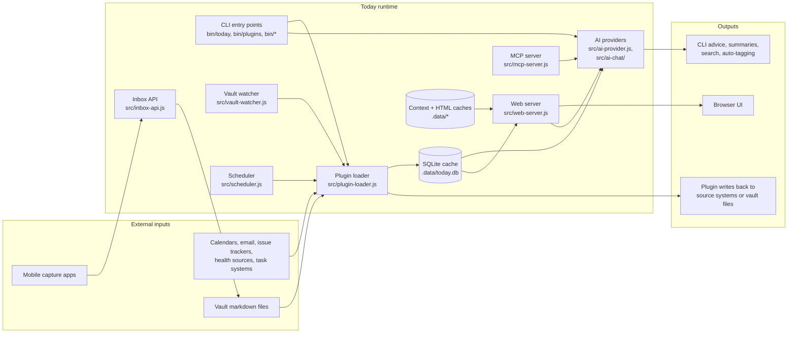
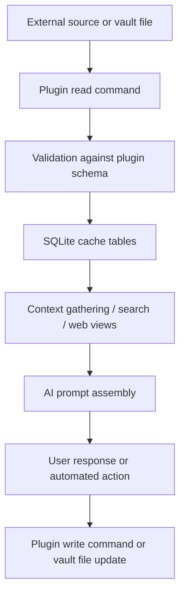
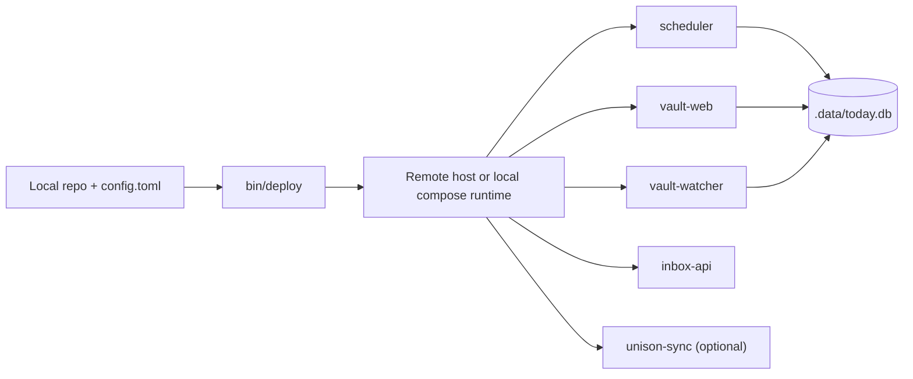

# Architecture

This document gives new contributors a map of how Today is put together. It is based on the current code in `src/`, `bin/`, `plugins/`, `config/`, and `deploy/`.

## System architecture diagram



## High-level component model

Today has four main layers:

1. **Ingress and sync**: plugins read from external systems or vault files and normalize the results.
2. **Local cache and file storage**: plugin-backed data is cached in SQLite, while the vault remains file-based.
3. **User-facing interfaces**: the CLI, web server, inbox API, and MCP server expose the system.
4. **Automation and AI**: the scheduler, vault watcher, and AI integrations keep data fresh and generate output.

## Data flow

### Primary flow



### What happens during a sync

1. `src/plugin-loader.js` discovers enabled plugin sources from `config.toml`.
2. Each plugin's `read` command is executed with environment such as `PLUGIN_CONFIG`, `SOURCE_ID`, and `LAST_SYNC_TIME`.
3. Results are validated against `src/plugin-schemas.js`.
4. Rows are written into the plugin's table in `.data/today.db`.
5. `sync_metadata` is updated with timestamps, row counts, and incremental state.
6. Consumers such as `bin/today`, the web server, task queries, or auto-tagging read from the cache.
7. When a feature changes source-of-truth files, write commands or atomic file writes update the vault or upstream service, then later syncs pull the new state back into SQLite.

### Important data ownership rule

The SQLite database is a **cache**, not the source of truth. Plugin authors should write changes back to the original system or vault file, not directly treat SQLite as the permanent store.

## Database schema

### Schema source of truth

- `src/plugin-schemas.js` defines plugin-backed tables and field validation.
- `src/migrations.js` converts those definitions into migrations and adds system tables.
- `src/database-service.js` opens `.data/today.db` in WAL mode and exposes the shared database singleton.

### Database schema diagram

```mermaid
erDiagram
  sync_metadata {
    text source PK
    datetime last_synced_at
    text last_sync_files
    integer entries_count
    text extra_data
    datetime sync_locked_at
    text sync_locked_by
  }
  schema_version {
    integer version PK
    datetime applied_at
    text description
  }
  vault_files {
    text id PK
    text source
    text path
    text checksum
    integer mtime_ms
    text title
  }
  context_cache {
    text cache_key PK
    text content
    datetime created_at
  }
  time_logs {
    text id PK
    text source
    datetime start_time
    datetime end_time
    integer duration_minutes
  }
  diary {
    text id PK
    text source
    datetime date
    text text
  }
  issues {
    text id PK
    text source
    text title
    text state
    datetime opened_at
  }
  events {
    text id PK
    text source
    text title
    datetime start_date
    datetime end_date
  }
  tasks {
    text id PK
    text source
    text title
    text status
    date due_date
  }
  habits {
    text id PK
    text source
    text habit_id
    date date
    text status
  }
  email {
    text id PK
    text source
    text from_address
    text subject
    datetime date
  }
  projects {
    text id PK
    text source
    text title
    text status
    integer progress
  }
  health_metrics {
    text id PK
    text source
    date date
    text metric_name
    real value
  }
  financial_transactions {
    text id PK
    text source
    date date
    text account
    real amount
  }
  contacts {
    text id PK
    text source
    text full_name
    text primary_email
    text birthday
  }
```



### Plugin-backed tables

All plugin-backed tables include a `source` column so multiple configured sources can coexist without collisions.

| Plugin type | Table | Main fields |
|---|---|---|
| Time logs | `time_logs` | `start_time`, `end_time`, `duration_minutes`, `description` |
| Diary | `diary` | `date`, `text`, `metadata` |
| Issues | `issues` | `title`, `state`, `opened_at`, `url`, `metadata` |
| Events | `events` | `calendar_name`, `title`, `start_date`, `end_date`, `location` |
| Tasks | `tasks` | `title`, `status`, `priority`, `due_date`, `metadata` |
| Habits | `habits` | `habit_id`, `date`, `status`, `value`, `metadata` |
| Email | `email` | `from_address`, `subject`, `date`, `snippet`, `attachments` |
| Projects | `projects` | `title`, `status`, `topic`, `progress`, `attention_score` |
| Health | `health_metrics` | `date`, `metric_name`, `value`, `units`, `metadata` |
| Finance | `financial_transactions` | `date`, `account`, `payee`, `category`, `amount` |
| Contacts | `contacts` | `full_name`, `organization`, `primary_email`, `birthday` |

### System tables

| Table | Purpose |
|---|---|
| `schema_version` | Tracks applied migrations |
| `sync_metadata` | Tracks per-source sync timing, file lists, row counts, locks, and incremental state |
| `vault_files` | Stores checksums and metadata for content-aware vault change tracking |
| `context_cache` | Caches assembled AI context |

## Sync mechanisms

Today has more than one sync path because it manages both file-based data and external service data.

### 1. Scheduled plugin sync

- Implemented in `src/scheduler.js`
- Usually runs `bin/plugins sync` every 10 minutes
- Also runs built-in maintenance jobs such as markdown prerendering and health checks
- Uses jitter and in-flight job suppression to avoid overlapping expensive runs

This is the main way external systems are refreshed into the SQLite cache.

### 2. Vault watcher sync

- Implemented in `src/vault-watcher.js`
- Uses `chokidar` to watch the configured vault directory
- Maps changed files back to interested plugin sources
- Debounces bursts of edits, then performs targeted sync for affected sources only
- Excludes expensive or self-generating plugins such as `markdown-plans` to avoid feedback loops

This keeps file-backed plugins responsive without waiting for the next scheduler tick.

### 3. Working-tree sync

This is outside Today itself. The project expects users to sync the `vault/` directory with a file replication tool such as Syncthing, Unison, iCloud, Dropbox, or similar. That layer moves raw file changes between devices.

### 4. Committed-state sync

Also outside Today itself. Users manage `git pull`/`git push` for the vault repository separately from file replication. This shares commit history rather than unstaged file contents.

### 5. Sync safety

- `sync_metadata` stores per-source sync state and lock information.
- `src/db-health.js` can recreate the cache when corruption is detected because the data can be re-synced.
- `SYNC_DISABLED` prevents sync commands from running when the repository is in a state that risks data loss.
- `src/fs-atomic.js` is used for atomic file writes and compare-and-swap style updates.

## Deployment architecture

### Local deployment

Local deployments use the root `docker-compose.yml` and can enable these services:

- `scheduler`
- `vault-web`
- `vault-watcher`
- `inbox-api`
- `unison-sync`
- optional `ollama`

The project directory is bind-mounted into the container, `.data/` and cache directories persist across restarts, and `~/.ssh` can be mounted read-only for git operations.

### Remote deployment

Remote deployments are driven by `bin/deploy` and code in `src/deploy/`.

Typical shape:

1. Local `config.toml` is used as the source of deployment configuration.
2. `bin/deploy <name> setup` provisions the server.
3. Service units from `config/services/` run long-lived processes such as the scheduler, web server, and watcher.
4. Deployment commands run migrations and restart only the configured services.

### Deployment diagram



## File structure

```text
bin/         CLI entry points for users, automation, and deploy flows
src/         Application code: plugin loader, web server, scheduler, AI, deploy logic
src/web/     HTML templates and web UI helpers
plugins/     Built-in plugin implementations and plugin author docs
docs/        Contributor and user documentation
config/      Service templates and operational config files
deploy/      Deployment-specific Docker assets
test/        Jest test suite
skeleton/    Example or bootstrapped files copied into new setups
scripts/     Helper scripts, including inbox/mobile examples
tmp/         Local runtime scratch space
```

### Important paths for contributors

| Path | Why it matters |
|---|---|
| `bin/today` | Main CLI entry point |
| `src/plugin-loader.js` | Plugin discovery, sync orchestration, validation |
| `src/plugin-schemas.js` | Central data model definition |
| `src/migrations.js` | Database migration generation and system tables |
| `src/database-service.js` | Shared SQLite access |
| `src/web-server.js` | Main browser-facing application |
| `src/inbox-api.js` | Small REST API for mobile uploads |
| `src/scheduler.js` | Scheduled job orchestration |
| `src/vault-watcher.js` | Real-time vault-driven sync |
| `src/deploy/` | Provisioning and deploy commands |
| `plugins/README.md` | Plugin author guide |

## API documentation

Today exposes several interfaces, not just one REST API.

### CLI API

The primary user interface is the CLI in `bin/`. Important entry points include:

- `bin/today`: interactive or one-shot AI sessions
- `bin/plugins`: plugin management and sync
- `bin/deploy`: deployment management
- `bin/context`, `bin/tasks`, `bin/calendar`, `bin/diary`, `bin/track`: type-specific accessors

### Web server HTTP surface

`src/web-server.js` is the main browser-facing server. It uses Express with session-backed authentication stored in SQLite.

| Area | Routes | Notes |
|---|---|---|
| Auth | `GET/POST /auth/login`, `GET /auth/logout` | Session-based login |
| Cache admin | `GET /_cache/status`, `POST /_cache/clear`, `POST /_cache/warm` | Cache inspection and warming |
| Git UI | `GET /_git`, `GET /_git/diff`, `POST /_git/*` | Browser workflows for staging, commit, pull, push, discard |
| AI editing/chat | `POST /ai-edit/*path`, `POST /ai-chat/*path`, `POST /ai-chat-stream/*path`, `POST /ai-chat-directory/*path` | AI-assisted file and directory workflows |
| Conversation storage | `GET/PUT/DELETE /api/ai-chat/conversations/*path` | Persist browser chat threads |
| Search and editing | `GET /search`, `GET /edit/*path`, `POST /toggle-checkbox/*path` | Vault navigation and editing |
| Tasks and timers | `POST /task/toggle`, `POST /task/edit`, `POST /api/track/start`, `POST /api/track/stop`, `POST /api/task-timer/*` | Interactive task and time tracking |
| Document views | `GET /`, `GET /*path`, `GET /task/*taskId` | Render vault content and task detail pages |

### Inbox API

`src/inbox-api.js` exposes a small REST API for quick capture.

| Method | Route | Auth | Purpose |
|---|---|---|---|
| `GET` | `/health` | none | Health check |
| `POST` | `/inbox/upload` | `X-API-Key` or `api_key` | Upload plain text or JSON content into `vault/inbox/` |
| `GET` | `/inbox/list` | `X-API-Key` or `api_key` | List uploaded inbox markdown files |

### MCP server

`src/mcp-server.js` exposes tools for Model Context Protocol clients so IDE or agent workflows can interact with Today using the same underlying runtime.

## Contributor workflow notes

- Prefer editing `src/plugin-schemas.js` when changing plugin-backed data fields.
- Let `src/migrations.js` own schema creation and upgrades.
- Treat `.data/today.db` as disposable cache state.
- When changing sync behavior, check both `src/scheduler.js` and `src/vault-watcher.js`.
- When changing user-visible HTTP behavior, inspect both `src/web-server.js` and the corresponding tests under `test/`.
